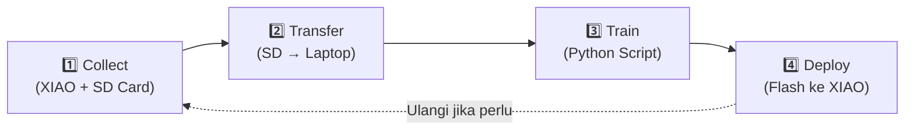

# EdgeWaste-CNN-LSTM ♻️🧠

**EdgeWaste-CNN-LSTM** is an end-to-end, real-time spatial-temporal waste classification pipeline engineered specifically for the highly constrained **Seeed Studio XIAO ESP32S3 Sense**. 

By combining a **MobileNetV2** (Spatial) feature extractor with a **Custom Unrolled LSTM** (Temporal) head, this project achieves high-accuracy, sub-second video classification directly on edge hardware.

---

## 🚀 Key Highlights

- **Hardware Target**: Seeed Studio XIAO ESP32S3 Sense (equipped with an OV3660 camera and 8MB PSRAM).
- **Split Architecture Strategy**:
  - **Spatial Extractor (CNN)**: A heavily quantized **MobileNetV2 (α0.35)** processes 48x48 RGB frames to extract 64 deep features per frame.
  - **Temporal Head (LSTM)**: A **Custom Manual Unrolled LSTM Cell** (forget, input, output gates + cell state) processes 3 consecutive frames to understand motion context (e.g., how the waste falls).
- **Bypassing TFLite Micro Limitations**: We completely bypassed the infamous `FILL` and `TRANSPOSE` operator crashes in TFLite Micro for ESP32 by implementing the mathematical structure of the LSTM cell using basic, perfectly supported Keras functional math operations (`Concatenate`, `Multiply`, `Add`, `Sigmoid`, `Tanh`).
- **Sub-Second Real-Time Performance**:
  - Accelerated by **ESP-NN** and clocked at **240 MHz**.
  - CNN Inference: **~240 ms / frame**.
  - LSTM Temporal Inference (3 frames): **~6 ms**.
  - Total Pipeline Latency: **~728 ms (1.4 FPS)**.

## 📂 Directory Structure

The repository is divided into three main operational phases:

```text
.
├── 1_collect/                   # Phase 1: Data Collection
│   └── src/main.cpp             # ESP32 firmware to capture and save JPEGs to SD Card
│
├── 2_train/                     # Phase 2: Model Training & Conversion (Python)
│   ├── test_cnn_lstm_concept_split.py  # End-to-end training and split model conversion
│   ├── saved_models_split/      # Quantized INT8 models (TFLite & C-arrays)
│   └── requirements.txt         # Python dependencies
│
└── 3_deploy/                    # Phase 3: Hardware Deployment
    └── xiao_inference_espnn/    # PlatformIO project for the XIAO ESP32S3
        ├── src/main.cpp         # Main inference loop (Camera capture, crop, CNN + LSTM)
        ├── partitions_8mb.csv   # Custom partition table to fit the MobileNetV2 model
        ├── sdkconfig.defaults   # Hardware overrides (240MHz CPU, PSRAM configs)
        └── platformio.ini       # Build configurations
```

## 🛠️ Requirements & Setup

### 1. Model Training (Python)
Navigate to `2_train` and install the requirements:
```bash
cd 2_train
pip install -r requirements.txt
python test_cnn_lstm_concept_split.py
```
This script will train the model, split the CNN and LSTM heads, quantize them into `INT8` via TensorFlow Lite, and export them as C-header arrays (`model_cnn_data.h` and `model_lstm_data.h`).

### 2. Deployment (PlatformIO)
You must use **PlatformIO** to compile and upload the inference firmware.
1. Open the `3_deploy/xiao_inference_espnn` folder in your IDE (VSCode/Cursor).
2. Ensure you do a clean build whenever you change `sdkconfig.defaults`.
3. Build and Upload:
```bash
pio run -t upload -e xiao_esp32s3
```
4. Open the Serial Monitor (`pio device monitor -b 115200`).

## 🧠 Why a "Custom" LSTM?
Standard Keras `LSTM` layers inject dynamic-shape operators (`FILL`, `SHAPE`, `TRANSPOSE`) into the graph. TFLite Micro on ESP32 notoriously struggles to allocate dynamic arenas for these ops during INT8 quantization, causing device crashes. 

To maintain the **strict academic requirement** of a "CNN + LSTM" architecture, we manually unrolled 3 time-steps of an LSTM cell using fundamental operations. To the mathematics, it is a 100% true LSTM. To the ESP32 compiler, it is just a sequence of highly optimized, static, and safe fully-connected operations.

# 📖 Tutorial: Train & Deploy Ulang Model Waste Classifier

> Tutorial mandiri untuk retrain model CNN-LSTM dan deploy ke XIAO ESP32S3 Sense.  
> Terakhir diupdate: 7 Mei 2026

---

## 🗂️ Struktur Proyek

```
TANEV/
├── 1_collect/          ← Firmware pengambilan dataset (Arduino)
├── 2_train/            ← Script training + model (Python)
│   ├── dataset/        ← Dataset gambar (kertas/, plastik/, organik/)
│   ├── train_real_data.py          ← Script utama training
│   ├── test_model.py               ← Script testing INT8 model
│   ├── generate_report_graphs.py   ← Script generate grafik laporan
│   ├── saved_models_split/         ← Output model TFLite + header .h
│   └── venv/                       ← Python virtual environment
└── 3_deploy/           ← Firmware inferensi (ESP-IDF)
    └── xiao_inference_espnn/       ← PlatformIO project untuk deploy
        └── src/
            ├── main.cpp            ← Firmware inferensi
            ├── model_cnn_data.h    ← Model CNN (dari training)
            └── model_lstm_data.h   ← Model LSTM (dari training)
```

---

## 📋 Alur Lengkap (4 Fase)



---

## Fase 1️⃣ — Collect Dataset (Opsional, kalau mau tambah data)

> [!NOTE]
> Skip fase ini jika dataset sudah cukup dan hanya ingin retrain.

### 1.1 Flash Firmware Collector

Di Cursor/VSCode, buka folder `1_collect`, lalu:

```bash
# Build & Upload firmware collector
# Gunakan PlatformIO: Upload (tombol → di status bar)
# Atau via terminal:
cd /Users/yogasatyawisesa/TANEV/1_collect
pio run -e xiao_esp32s3 --target upload
```

### 1.2 Buka Serial Monitor

```bash
pio device monitor
```

### 1.3 Pilih Kelas & Rekam

Di Serial Monitor, ketik huruf untuk pilih kelas:

| Huruf | Kelas    |
|-------|----------|
| `k`   | Kertas   |
| `p`   | Plastik  |
| `o`   | Organik  |
| `c`   | Capture (dari Serial, tanpa tombol) |
| `r`   | Reset counter semua kelas |

**Cara capture:**
1. Ketik huruf kelas (misal `k` untuk kertas)
2. Arahkan kamera ke objek sampah
3. **Tekan tombol fisik** (pin D7) ATAU ketik `c` di Serial Monitor
4. LED flash menyala → kamera merekam 3 detik
5. Frame tersimpan di SD card: `/kertas/sesi_001/frame_001.jpg`, dst.
6. Ulangi untuk semua kelas

> [!TIP]
> Target ideal: **minimal 50-100 sesi per kelas** untuk hasil yang baik.
> Variasikan sudut, jarak, pencahayaan, dan jenis objek.

---

## Fase 2️⃣ — Transfer Dataset ke Laptop

### 2.1 Cabut SD Card dari XIAO

Matikan XIAO, cabut SD card.

### 2.2 Copy ke Folder Dataset

Masukkan SD card ke card reader laptop, lalu copy:

```bash
# Copy dari SD card ke folder dataset
# (ganti /Volumes/SD_CARD sesuai nama SD card kamu)

# Hapus dataset lama (HATI-HATI!)
rm -rf /Users/yogasatyawisesa/TANEV/2_train/dataset/kertas/*
rm -rf /Users/yogasatyawisesa/TANEV/2_train/dataset/plastik/*
rm -rf /Users/yogasatyawisesa/TANEV/2_train/dataset/organik/*

# Copy dataset baru dari SD card
cp -r /Volumes/SD_CARD/kertas/sesi_*  /Users/yogasatyawisesa/TANEV/2_train/dataset/kertas/
cp -r /Volumes/SD_CARD/plastik/sesi_* /Users/yogasatyawisesa/TANEV/2_train/dataset/plastik/
cp -r /Volumes/SD_CARD/organik/sesi_* /Users/yogasatyawisesa/TANEV/2_train/dataset/organik/
```

### 2.3 Verifikasi Dataset

```bash
# Cek jumlah sesi per kelas
echo "=== Jumlah Sesi ==="
echo "Kertas:  $(ls -d /Users/yogasatyawisesa/TANEV/2_train/dataset/kertas/sesi_* 2>/dev/null | wc -l)"
echo "Plastik: $(ls -d /Users/yogasatyawisesa/TANEV/2_train/dataset/plastik/sesi_* 2>/dev/null | wc -l)"
echo "Organik: $(ls -d /Users/yogasatyawisesa/TANEV/2_train/dataset/organik/sesi_* 2>/dev/null | wc -l)"
```

> [!IMPORTANT]
> Pastikan struktur folder benar:
> ```
> dataset/
> ├── kertas/
> │   ├── sesi_001/
> │   │   ├── frame_001.jpg
> │   │   ├── frame_002.jpg
> │   │   └── ...
> │   ├── sesi_002/
> │   └── ...
> ├── plastik/
> │   └── sesi_001/ ...
> └── organik/
>     └── sesi_001/ ...
> ```
> Setiap `sesi_xxx/` harus berisi **minimal 3 file .jpg** (frame).

---

## Fase 3️⃣ — Training Model 🧠

### 3.1 Aktifkan Virtual Environment

```bash
cd /Users/yogasatyawisesa/TANEV/2_train
source venv/bin/activate
```

> [!NOTE]
> Jika `venv` belum ada atau error, buat baru:
> ```bash
> python3 -m venv venv
> source venv/bin/activate
> pip install tensorflow numpy scipy matplotlib
> ```

### 3.2 Jalankan Training

```bash
python train_real_data.py
```

**Apa yang terjadi saat training:**

| Tahap | Deskripsi | Waktu ± |
|-------|-----------|---------|
| Load Data | Membaca semua sesi, ambil 3 frame per sesi (awal, tengah, akhir) | ~10 detik |
| Stratified Split | Bagi data 80% train / 20% val (per kelas) | ~1 detik |
| Augmentasi | Augmentasi training set → 200 sampel per kelas (flip, rotate, zoom, brightness, noise) | ~30 detik |
| Phase 1 | Training head saja (MobileNetV2 frozen), 15 epoch, lr=1e-3 | ~5-10 menit |
| Phase 2 | Fine-tune seluruh model (unfreeze backbone), 30 epoch, lr=5e-5 | ~15-30 menit |
| Konversi TFLite | Konversi ke INT8 quantized (.tflite) | ~2 menit |
| Export .h | Generate C header files (xxd) | ~5 detik |
| Test | Jalankan test_model.py otomatis | ~1 menit |

**Output yang dihasilkan:**

```
saved_models_split/
├── waste_cnn_int8.tflite      ← Model CNN (±713 KB)
├── waste_lstm_int8.tflite     ← Model LSTM (±63 KB)
├── model_cnn_data.h           ← Header C untuk CNN
└── model_lstm_data.h          ← Header C untuk LSTM
```

### 3.3 Cek Hasil Training

Perhatikan output di terminal:

```
--- Final Evaluation ---
  Training   — Loss: X.XXXX, Accuracy: XX.X%
  Validation — Loss: X.XXXX, Accuracy: XX.X%

--- Per-Class Accuracy (Validation Set) ---
  kertas:  XX.X%
  plastik: XX.X%
  organik: XX.X%
```

> [!WARNING]
> Jika validation accuracy < 60%, pertimbangkan:
> - Tambah data (kembali ke Fase 1)
> - Cek apakah gambar buram/gelap
> - Pastikan objek terlihat jelas di frame

### 3.4 (Opsional) Generate Grafik Laporan

```bash
python generate_report_graphs.py
```

Output grafik tersimpan di `report_grafik/`:
- Training loss & accuracy
- Confusion matrix
- Dataset distribution
- Learning rate schedule
- Model size & inference time

### 3.5 (Opsional) Test Model Secara Terpisah

```bash
python test_model.py
```

Ini menjalankan model INT8 pada beberapa sampel dari dataset dan menampilkan prediksi per sesi.

---

## Fase 4️⃣ — Deploy ke XIAO ESP32S3 🚀

### 4.1 Copy Model Headers ke Firmware

```bash
# Copy file .h hasil training ke folder firmware deploy
cp /Users/yogasatyawisesa/TANEV/2_train/saved_models_split/model_cnn_data.h \
   /Users/yogasatyawisesa/TANEV/3_deploy/xiao_inference_espnn/src/model_cnn_data.h

cp /Users/yogasatyawisesa/TANEV/2_train/saved_models_split/model_lstm_data.h \
   /Users/yogasatyawisesa/TANEV/3_deploy/xiao_inference_espnn/src/model_lstm_data.h
```

> [!CAUTION]
> **Wajib copy KEDUA file** (`model_cnn_data.h` DAN `model_lstm_data.h`).
> Jika hanya copy salah satu, model akan mismatch dan prediksi salah!

### 4.2 Build & Flash Firmware

Di Cursor/VSCode, buka folder `3_deploy/xiao_inference_espnn`, lalu:

```bash
cd /Users/yogasatyawisesa/TANEV/3_deploy/xiao_inference_espnn

# Build
pio run -e xiao_esp32s3

# Upload ke board
pio run -e xiao_esp32s3 --target upload
```

> [!NOTE]
> Pastikan **SD card sudah DICABUT** dari XIAO sebelum upload firmware inferensi,
> karena firmware deploy tidak menggunakan SD card (langsung kamera → inferensi).

### 4.3 Monitor Hasil Inferensi

```bash
pio device monitor
```

Output yang diharapkan:

```
[ESPNN] =============================================
[ESPNN]   TEST INFERENSI + KAMERA DI ESP32S3
[ESPNN]   MobileNetV2 a0.35 | 48x48 RGB | 3 Frames
[ESPNN]   >>> ESP-NN AKTIF | CPU 240MHz <<<
[ESPNN] =============================================
[ESPNN] [OK] PSRAM Total: 8.0 MB, Free: X.X MB
[ESPNN] [OK] CNN siap. Input: 6912 bytes, Arena: XXXXX bytes
[ESPNN] [OK] LSTM siap. Input: 192 bytes, Arena: XXXXX bytes
...
[ESPNN] --- HASIL (ESP-NN + KAMERA) ---
[ESPNN]   >>> Prediksi: kertas (85.3%) <<<
[ESPNN]   Confidence: kertas=85.3%, plastik=10.2%, organik=4.5%
```

---

## 🔄 Ringkasan Quick Reference

Kalau sudah pernah collect dan hanya mau **retrain + redeploy**, cukup 3 langkah:

```bash
# 1. TRAIN (di folder 2_train)
cd /Users/yogasatyawisesa/TANEV/2_train
source venv/bin/activate
python train_real_data.py

# 2. COPY MODEL (setelah training selesai)
cp saved_models_split/model_cnn_data.h \
   /Users/yogasatyawisesa/TANEV/3_deploy/xiao_inference_espnn/src/model_cnn_data.h
cp saved_models_split/model_lstm_data.h \
   /Users/yogasatyawisesa/TANEV/3_deploy/xiao_inference_espnn/src/model_lstm_data.h

# 3. DEPLOY (di folder 3_deploy/xiao_inference_espnn)
cd /Users/yogasatyawisesa/TANEV/3_deploy/xiao_inference_espnn
pio run -e xiao_esp32s3 --target upload
pio device monitor
```

**Itu saja! 3 command utama: train → copy → deploy.** ✅

---

## ❓ Troubleshooting

### Training

| Masalah | Solusi |
|---------|--------|
| `ModuleNotFoundError: No module named 'tensorflow'` | Jalankan `source venv/bin/activate` dulu, atau install: `pip install tensorflow` |
| `ModuleNotFoundError: No module named 'scipy'` | `pip install scipy` |
| Accuracy rendah (<60%) | Tambah data, variasikan objek, cek kualitas gambar |
| Training sangat lambat | Normal di CPU Mac (~30 menit total). Bisa pakai Google Colab untuk GPU |
| `xxd: command not found` | Install: `brew install xxd` atau sudah termasuk di macOS |

### Deploy

| Masalah | Solusi |
|---------|--------|
| Build error `model_cnn_data.h not found` | Pastikan sudah copy file .h dari step 4.1 |
| `CNN AllocateTensors() gagal!` | Model terlalu besar. Pastikan pakai model dari `saved_models_split/` (bukan `saved_models/`) |
| `PSRAM tidak terdeteksi!` | Cek koneksi board, pastikan `build_flags = -DBOARD_HAS_PSRAM` di platformio.ini |
| Prediksi selalu sama / random | Cek apakah kedua model (.h) sudah ter-copy. Retrain jika perlu |
| Upload gagal | Pastikan board dalam mode bootloader (tekan-tahan BOOT lalu tekan RESET) |

### Data Collection

| Masalah | Solusi |
|---------|--------|
| `SD card tidak terbaca` | Pastikan SD card FAT32, ukuran ≤ 32GB. Cek pin CS (D21) |
| Frame NULL / capture gagal | Konektor kamera longgar. Cabut-pasang ulang flex cable |
| Gambar gelap | LED flash menyala otomatis. Jika masih gelap, tambah cahaya eksternal |

---

## 📊 Parameter yang Bisa Diubah

Jika ingin tweak training, edit [train_real_data.py](file:///Users/yogasatyawisesa/TANEV/2_train/train_real_data.py):

| Parameter | Lokasi (Line) | Default | Keterangan |
|-----------|---------------|---------|------------|
| `IMG_HEIGHT/WIDTH` | 15-16 | 48 | Resolusi input. Jangan ubah kecuali ubah firmware juga |
| `SEQUENCE_LENGTH` | 18 | 3 | Jumlah frame per sesi. Jangan ubah |
| `NUM_CLASSES` | 19 | 3 | Jumlah kelas |
| `CLASS_NAMES` | 20 | kertas, plastik, organik | Nama kelas |
| `BATCH_SIZE` | 22 | 8 | Ukuran batch. Naikkan jika RAM cukup |
| `target_per_class` | 191 | 200 | Target augmentasi per kelas. Naikkan untuk data lebih banyak |
| Phase 1 epochs | 312 | 15 | Epoch fase freeze |
| Phase 2 epochs | 329 | 30 | Epoch fase fine-tune |
| Phase 1 lr | 306 | 1e-3 | Learning rate fase 1 |
| Phase 2 lr | 323 | 5e-5 | Learning rate fase 2 |

> [!WARNING]
> Jangan ubah `IMG_HEIGHT`, `IMG_WIDTH`, `SEQUENCE_LENGTH`, atau `NUM_FEATURES` tanpa juga mengubah firmware deploy (`main.cpp`), karena model dan firmware harus sinkron!


## 📝 License
This project is open-source and free to use for academic and research purposes.
